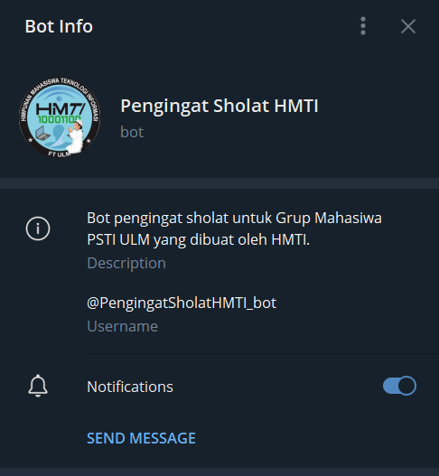

<!--
*** Thanks for checking out the Best-README-Template. If you have a suggestion
*** that would make this better, please fork the repo and create a pull request
*** or simply open an issue with the tag "enhancement".
*** Thanks again! Now go create something AMAZING! :D
-->

<!-- PROJECT SHIELDS -->
<!--
*** I'm using markdown "reference style" links for readability.
*** Reference links are enclosed in brackets [ ] instead of parentheses ( ).
*** See the bottom of this document for the declaration of the reference variables
*** for contributors-url, forks-url, etc. This is an optional, concise syntax you may use.
*** https://www.markdownguide.org/basic-syntax/#reference-style-links
-->

[![Contributors][contributors-shield]][contributors-url]
[![Forks][forks-shield]][forks-url]
[![Stargazers][stars-shield]][stars-url]
[![Issues][issues-shield]][issues-url]
[![MIT License][license-shield]][license-url]
[![LinkedIn][linkedin-shield]][linkedin-url]
[![Telegram][telegram-shield]][telegram-url]

<!-- PROJECT LOGO -->
<br />
<p align="center">
  <a href="https://github.com/othneildrew/Best-README-Template">
    
    <!--  -->
  </a>

  <h3 align="center">Bot Pengingat Sholat HMTI</h3>

  <p align="center">
    Bot telegram sederhana sebagai pengingat sholat
    <br />
    <a href="https://github.com/uluumbch/bot-pengingat-sholat-hmti"><strong>Explore the docs »</strong></a>
    <br />
    <br />
    <a href="https://github.com/othneildrew/Best-README-Template">View Demo</a>
    ·
    <a href="https://github.com/uluumbch/bot-pengingat-sholat-hmti/issues">Report Bug</a>
    ·
    <a href="https://github.com/uluumbch/bot-pengingat-sholat-hmti/issues">Request Feature</a>
  </p>
</p>

<!-- TABLE OF CONTENTS -->
<details open="open">
  <summary>Daftar isi</summary>
  <ol>
    <li>
      <a href="#about-the-project">About The Project</a>
      <ul>
        <li><a href="#built-with">Built With</a></li>
      </ul>
    </li>
    <li>
      <a href="#getting-started">Getting Started</a>
      <ul>
        <li><a href="#prerequisites">Prerequisites</a></li>
        <li><a href="#installation">Installation</a></li>
      </ul>
    </li>
    <li><a href="#usage">Usage</a></li>
    <li><a href="#roadmap">Roadmap</a></li>
    <li><a href="#contributing">Contributing</a></li>
    <li><a href="#license">License</a></li>
    <li><a href="#contact">Contact</a></li>
    <li><a href="#acknowledgements">Acknowledgements</a></li>
  </ol>
 </details>

- [Tentang Projek](#tentang-projek)
  - [Teknologi yang Digunakan](#teknologi-yang-digunakan)
- [Memulai](#memulai)
  - [Prasyarat](#prasyarat)
  - [Konfigurasi](#konfigurasi)
- [Penggunaan](#penggunaan)
- [Berkontribusi](#berkontribusi)
- [Lisensi](#lisensi)
- [Kontak](#kontak)

<!-- ABOUT THE PROJECT -->

## Tentang Projek

<p align = "center">

</p>
Sebuah bot sederhana yang dapat mengirimkan pesan secara otomatis ke grup telegram. Bot akan mengirimkan pesan(berupa gambar) berdasarkan waktu sholat pada hari itu.

Kenapa menggunakan Bot?

- Bot dapat mengirimkan pesan secara otomatis sesuai dengan waktu yang kita tentukan.
- Tidak perlu sumber daya yang besar untuk dapat menjalankan Bot di server lokal
- Bot tidak memiliki nomor telepon seperti akun biasa. Sehingga tidak mungkin untuk terkena spam.

### Teknologi yang Digunakan

Beberapa teknologi yang digunakan untuk membangun Bot ini diantaranya:

- [Node.js](http://nodejs.org/)
  <details>
  

  Node.js adalah runtime environment untuk JavaScript yang bersifat open-source dan cross-platform. Dengan Node.js kita dapat menjalankan kode JavaScript di mana pun, tidak hanya terbatas pada lingkungan browser.

  Node.js menjalankan V8 JavaScript engine (yang juga merupakan inti dari Google Chrome) di luar browser. Ini memungkinkan Node.js memiliki performa yang tinggi.
  </details>

- [Axios](https://www.npmjs.com/package/axios)
  <details>
  Axios adalah sebuah library pada Node js yang dapat digunakan untuk melakukan fetch pada API. Axios lebih mudah digunakan jika dibandingkan dengan library lain yang juga digunakan untuk fetch API, selain itu axios juga gratis (open source)
  </details>
- [node-telegram-bot-api](https://github.com/yagop/node-telegram-bot-api/)
  <details>
  package pada Node.js yang digunakan untuk berkomunikasi dengan <a href="https://github.com/yagop/node-telegram-bot-api/">API Telegram Bot</a>. Package ini membantu kita untuk mengirim dan menerima API telegram.
  </details>
- [node-cron](https://github.com/node-cron/node-cron)
  <details>
  Paket ini memungkinkan kita untuk menjadwalkan perintah(menjalankan fungsi) dan mengotomatisasi perintah di node.js menggunakan sintaks crontab.

  Kita menggunakan <a href="https://en.wikipedia.org/wiki/Cron">Cron</a> agar dapat menjalankan perintah secara otomatis atau melakukan perintah seperti menjalankan sebuah fungsi sesuai dengan jadwal yang kita inginkan.
  </details>

<!-- GETTING STARTED -->

## Memulai

Untuk dapat menjalankan projek ini di komputer lokal kita atau melakukan pengembangan lebih jauh, ikuti langkah-langkah dibawah ini:

This is an example of how you may give instructions on setting up your project locally.
To get a local copy up and running follow these simple example steps.

### Prasyarat

- node js

  download disini

  [](https://nodejs.org/en/download/)

  cek versi

  ```sh
  node -v
  ```

  atau

  ```sh
  node --version
  ```

- npm

  instal npm

  ```sh
  npm install npm@latest -g
  ```

  cek versi npm untuk memastikan sudah terinstal

  ```sh
  npm -v
  ```

  atau

  ```sh
  npm --version
  ```

### Konfigurasi

1. Buat bot telegram terlebih dahulu melalui [@botfather](t.me/botfather).
2. Download repo atau clone dengan cara
   ```sh
   git clone https://github.com/uluumbch/bot-pengingat-sholat-hmti.git
   ```
3. Buka hasil download menggunakan kode editor
4. Instal paket npm yang dibutuhkan. Jalankan perintah
   ```sh
   npm install
   ```
5. Buka file `index.js` dan edit pada bagian TOKEN dengan token bot kamu
   ```JS
   const TOKEN = 'ENTER YOUR API'; // masukan token bot disini
   ```
6. Edit variabel group_id dengan id grup tujuan. Untuk mendapatkan grup id ikuti langkah berikut: cara mendapatkan grup id

   ```js
   const group_id = "masukkan id grup";
   ```

<!-- USAGE EXAMPLES -->

## Penggunaan

Setelah kode dijalankan kita dapat mengirimkan pesan ke bot untuk dapat menerima respon. Coba buka bot dan klik start atau kirim pesan `/start`. Jika tidak ada error maka bot akan memberikan balasan kepada pengirim pesan. Untuk dapat mengetahui hasil respon bot dapat dilihat pada konsol.

_Untuk mengedit perintah silakan membaca [Dokumentasi Telegram](https://core.telegram.org/bots/api) atau [Dokumentasi node-telegram-bot-api](https://github.com/yagop/node-telegram-bot-api/)_

<!-- CONTRIBUTING -->

## Berkontribusi

Dengan berkontribusi kita dapat saling membantu untuk membuat sebuah projek yang lebih baik. Kontribusi anda akan sangat berpengaruh untuk kesempurnaan sebuah sistem. **Segala jenis kontribusi anda akan sangat berguna**

1. Fork projek ini
2. Buat branch baru (`git checkout branchBaru`)
3. Commit perubahan (`git commit -m 'menambahkan fitur baru yang keren'`)
4. Push perubahan ke branch anda (`git push origin branchBaru`)
5. Lakukan pull request

<!-- LICENSE -->

## Lisensi

Projek ini didistribusikan dibawah lisensi MIT. Untuk informasi lebih lengkap silakan merujuk pada `LICENSE`.

<!-- CONTACT -->

## Kontak

Bachrul Uluum - [@uluumbch](t.me/uluumbch) - halo.uluum@gmail.com

Link Projek: [https://github.com/uluumbch/bot-pengingat-sholat-hmti](https://github.com/uluumbch/bot-pengingat-sholat-hmti)

<!-- ACKNOWLEDGEMENTS -->

<!-- MARKDOWN LINKS & IMAGES -->
<!-- https://www.markdownguide.org/basic-syntax/#reference-style-links -->

[contributors-shield]: https://img.shields.io/github/contributors/uluumbch/bot-pengingat-sholat-hmti.svg?style=for-the-badge
[contributors-url]: https://github.com/uluumbch/bot-pengingat-sholat-hmti/graphs/contributors
[forks-shield]: https://img.shields.io/github/forks/uluumbch/bot-pengingat-sholat-hmti.svg?style=for-the-badge
[forks-url]: https://github.com/uluumbch/bot-pengingat-sholat-hmti/network/members
[stars-shield]: https://img.shields.io/github/stars/uluumbch/bot-pengingat-sholat-hmti.svg?style=for-the-badge
[stars-url]: https://github.com/uluumbch/bot-pengingat-sholat-hmti/stargazers
[issues-shield]: https://img.shields.io/github/issues/uluumbch/bot-pengingat-sholat-hmti.svg?style=for-the-badge
[issues-url]: https://github.com/uluumbch/bot-pengingat-sholat-hmti/issues
[license-shield]: https://img.shields.io/github/license/uluumbch/bot-pengingat-sholat-hmti.svg?style=for-the-badge
[license-url]: https://github.com/uluumbch/bot-pengingat-sholat-hmti/blob/main/LICENSE.txt
[linkedin-shield]: https://img.shields.io/badge/-LinkedIn-black.svg?style=for-the-badge&logo=linkedin&colorB=555
[linkedin-url]: https://linkedin.com/in/bachrul-uluum
[telegram-shield]: https://img.shields.io/badge/Telegram-2CA5E0?style=for-the-badge&logo=telegram&logoColor=white
[telegram-url]: t.me/uluumbch
